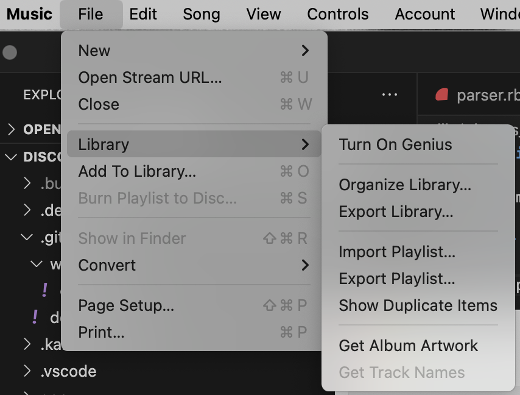

# iTunes / Music app importer

I'm using my iTunes Library that I've had for ages to do the initial seed of all the mp3s and CDs into the `media_items` table.

## Setup

- Export your local Music.app Library to the XML format (see screenshot)

- `File -> Library -> Export Library...`

- `mv` `Library.xml` into this folder (`lib/itunes_import`)

## Commands

### Step 1: Generate the JSON

- `rails c`
- `ItunesImport::Parser.parse`

This will generate a json artifact with the proper formatting

### Step 2: Import into Artist and MediaItems tables

- `rails c`
- `parser = ItunesImport::Parser.new`
- `parser.import_media`